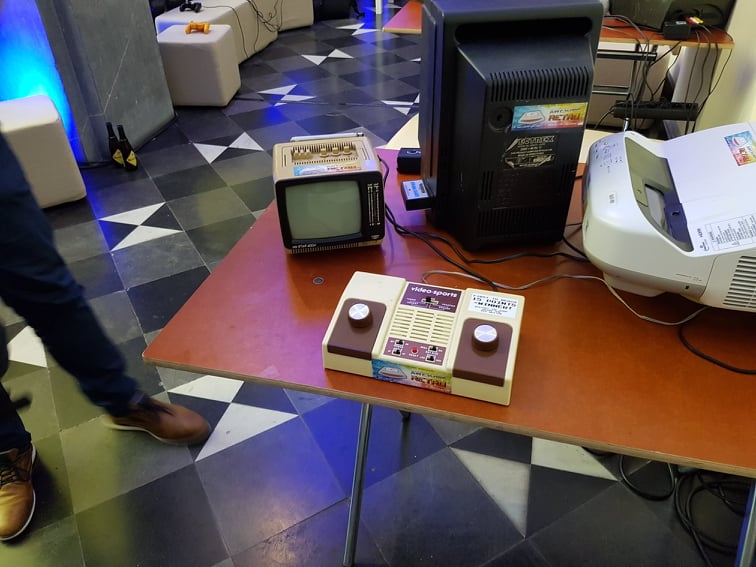

# Brucon dag 1
##### 10/10/2019

De eerste dag van brucon has arrived. We waren optijd vertrokken maar 1iemand van de groep had de trein gemist waardoor we op hem moesten wachten. Hierdoor kwamen we de eerste dag al te laat voor de eerste lezing. Geen probleem want eigenlijk was het een lezing waar geen van ons naar toe wou gaan. Dus hebben we het eerste uur wat retro games gespeeld. 

Toen kwam de 2de lezing eraan en dachten we waarom gaan we daar is niet naartoe. Toen we er toekwamen bleek de zaal al zeer vol te zitten dus hadden we een plaatsje redelijk van voor geclaimd. Toen de 2mannen met hun uitleg begonnen leek het al snel een vergissing om er naartoe te gaan. Ze waren niet verstaanbaar en niet interessant.

De lezing hierna was dan wel interessanter deze was genaamd “a hackers view to the upcoming ISO/SAE 21434”. De persoon die deze uitleg gaf was interessant gemotiveerd en gebeten door zijn onderwerp. Zijn presentatie zat ook goed in elkaar ondanks dat hij deze nog maar net gemaakt had. (tijdens de talk die voor hem kwam)

Hierna zijn we naar een talk om 15u gegaan over human side channels and their implications for security and privacy. Deze talk was ook een interessante en ook de laatste talk die ik gevolgd heb. Ik moest namelijk in de avond naar de dokter waardoor ik de dag vroeger heb moeten afsluiten.
