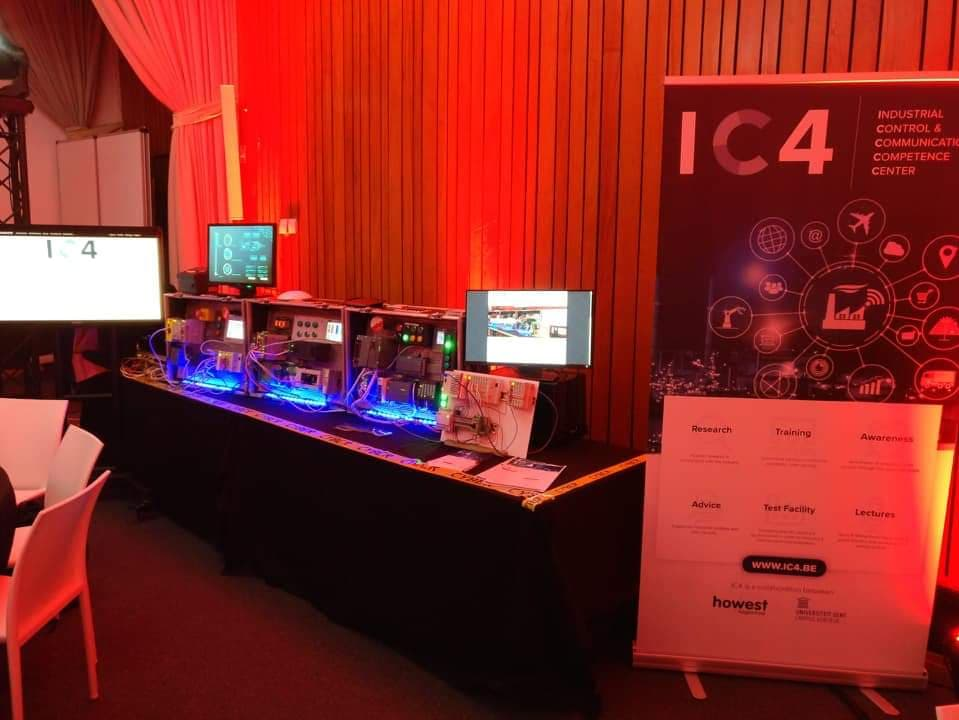
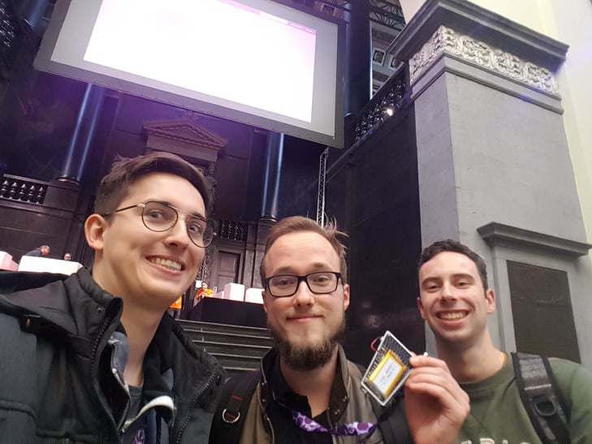
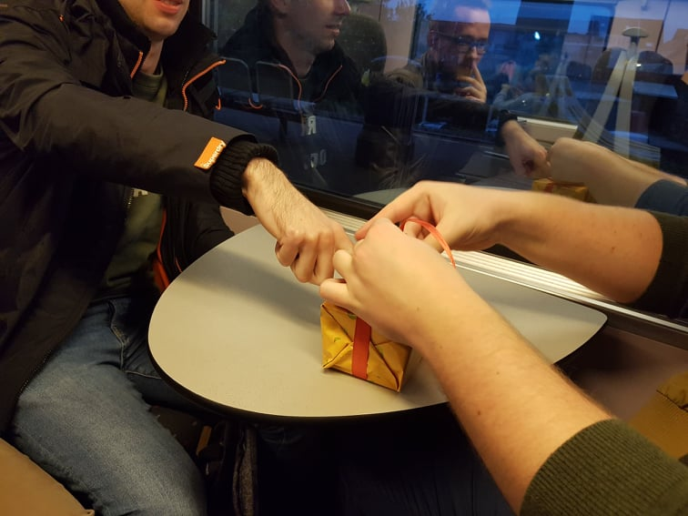

# Brucon dag 2
##### 11/10/2019

De tweede dag van brucon. Deze keer was iedereen optijd toegekomen waardoor we vroeger in brucon waren toegekomen. Maar omdat we niet direct een interessante talk zagen dachten we kom we gaan eens proberen aan de ctf meetedoen.

Toen we eraan begonnen hadden we al snel door dat deze makkelijker was dan die van zondag. We vonden vlot een paar vlaggen en voor we het wisten stonden we in de top 10 en waren we paar uur verder. 

Natuurlijk kwam nu onze competitieve geest boven en gingen we voluit voor de top 3. Dit hebben we dan ook nipt gehaald. De prijsuitreiking was jammer genoeg wel pas bij de brucon closing. Dus moesten we nog blijven tot 18u30. Het was toen nog maar 16u. Dus hebben we eerst genoten van een wel verdiende coffee break en  daarna zijn we nog wat retro games gaan spelen. Tot ze opeens de beamers hadden uitgezet en we wel moesten stoppen.

We hebben ons dan nog even neergezet op een gemakkelijk bankje tot de laatste talk ging beginnen. Deze hebben we dan gevolgd en wat zijn we blij dat we dat gedaan hebben. Deze talk was zeer interessant en ook de persoon die dit gaf kwam goed voor de dag met hier en daar een mopje erbij. Al bij al dus niet zo erg dat we tot het laatste moesten blijven. 

Als prijs hebben we uiteindelijk een bakje pralines gekregen. Jammer want ik lust geen chocolade… Achja laten we maar vooral onthouden dat ik redelijk wat vlaggen had gevonden.

