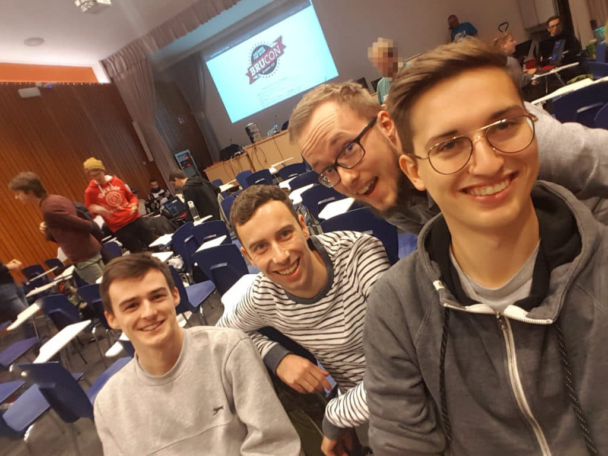

# student ctf
##### 6/10/2019
Als eerst cyber security challenge  waar ik naartoe ben gegaan had ik gekozen voor de brucon student ctf.

We zijn optijd vertrokken vanuit Sint-Niklaas met de trein en vanuit sint-pieters zijn we te voet verder gegaan naar de ctf. Toen we toekwamen hadden we gezien dat we blijkbaar langer hadden gestapt dan verwacht. Laten we het maar op de vermoeidheid steken.

Eenmaal ingeschreven kwamen we toe in de zaal voor de ctf. Jammer genoeg waren hier geen goeie tafels voorzien maar moesten we het doen met stoeltjes waar er een klaptafeltje aanzat. Jammer want op brucon zelf kunnen ze er wel een tafel zetten.

Toen we begonnen met vlaggen zoeken leek het me al snel duidelijk dat het niveau voor mij persoonlijk te hoog lag. Maar met toch wat proberen en prutsen heb ik hier en daar toch een vlag kunnen vinden.

Het leukste voor mij was erin slagen om de handboeien los te krijgen van de radiator. Dit is blijkbaar veel makkelijker dan initieel gedacht.

Op het einde van de dag zijn we niet gewonnen maar hebben we ons wel geamuseerd. Het grootste nadeel was alleen dat ze te weinig broodjes hadden besteld/gekregen. Hierdoor moesten we zelf nog eten gaan halen. En verloren we tijd voor de CTF.

<a href="/index.html">Homepage</a>
