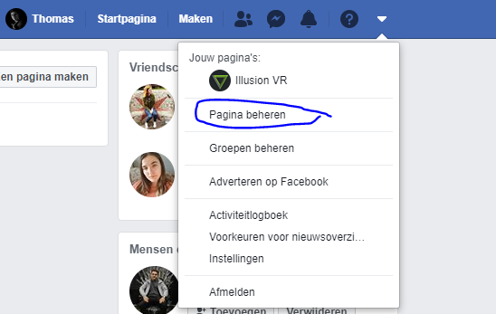
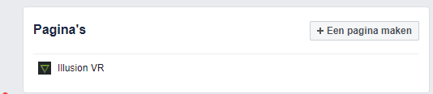
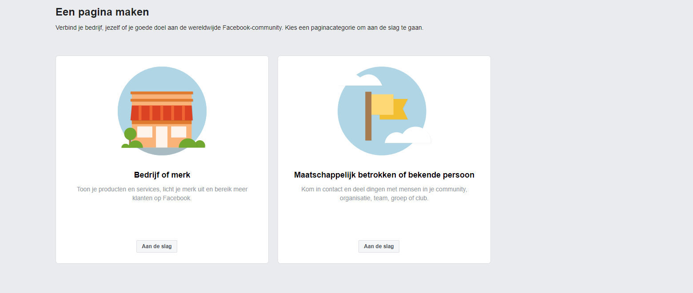
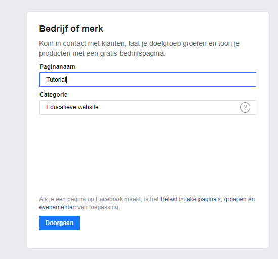
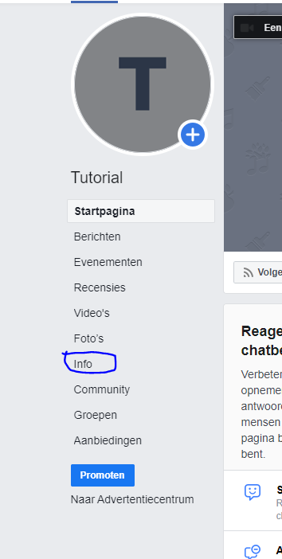
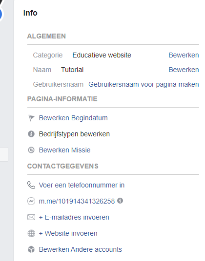
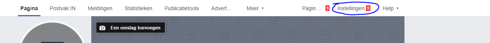
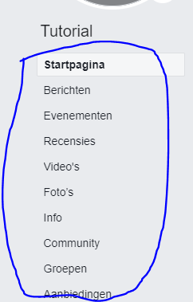
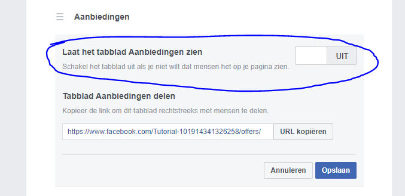

# Tutorial
##### 23/12/2019

## Hoe maak ik een facebookpagina aan?

Deze tutorial gaat over hoe je een facebookpagina aanmaakt.

## Stap 1:
Maak een facebook account aan. Je kan geen facebookpagina aanmaken zolang je geen facebook account hebt. Zorg er dus voor dat je een facebookaccount hebt en dat je aangemeld bent.

## Stap 2:
Duw op het pijltje naast het vraagtekentje. Daar zal staan “pagina beheren” klik hier op.
 

## Stap 3:
Klik op “een pagina maken”.
 

## Stap 4:
Kies wat voor soort pagina je wilt maken.
 

Indien je een pagina wilt maken voor uw bedrijf of merk kies je voor de linkse optie. Wanneer je eerder over een bekend persoon een pagina wilt maken druk je rechts. Voor deze tutorial gaan we verder met een pagina voor een bedrijf.

## Stap 5:
Wanneer je op aan de slag hebt geduwd moet je een paginanaam en een categorie opgeven. Als naam van de pagina kan je best uw bedrijfsnaam nemen.
Bij categorie moet je een thema kiezen dat het beste bij uw bedrijf past. Voor het voorbeeld zal ik als naam: tutorial nemen & als categorie “educatieve website”.
 

## Stap 6: 
Nu krijg je de optie om een profielfoto in te stellen. Heb je een logo stel dan het logo in. Indien je nog niet weet wat je wilt instellen duw dan op overslaan.

## Stap 7:
Een omslagfoto toevoegen. Hier kan je instellen wat je wilt best zo goed mogelijk gerelateerd aan uw bedrijf. Indien je nog niet direct een foto hebt duw dan op overslaan. Je kan dit namelijk later altijd instellen/aanpassen.

## Stap 8:
U hebt een standaard pagina aangemaakt!

## Stap 9:
Informatie instellen van het bedrijf doen we bij info.
 

 
Wanneer u deze zaken wilt aanpassen moet u simpelweg gewoon op de link klikken en uw informatie ingeven. Vergeet natuurlijk achteraf niet op opslaan te duwen!

## Stap 10:
Details van de pagina instellen.
Wanneer u detail van de pagina wilt instellen duw dan op “instellingen”.
 

## Stap 11:
Belangrijkste informatie instellen.
De belangrijkste informatie kan je opgeven bij pagina-informatie.
 

 
Hier kan je onder anderen een beschrijving toevoegen. Maar ook contact gegevens, bedrijfslocatie & openingstijden.

## Stap 12:

 
Wanneer je wilt aanpassen hoeveel tabbladen er staan en in welke volgorde deze staan moet je weer naar instellingen gaan. (zie stap 10) en dan gaan naar “sjablonen en tabbladen”. Wanneer je bepaalde tabbladen wilt uitzetten klik je op “instellingen” & dan zet je “laat het tabblad [naam van het tabblad] zien” op uit. (zie afbeelding)
 

Indien u een nieuw tabblad wilt toevoegen duwt u op de knop “een tabblad toevoegen”. En kiest u het gewenste tabblad.
U heeft nu de belangrijkste dingen ingesteld voor uw facebookpagina.

